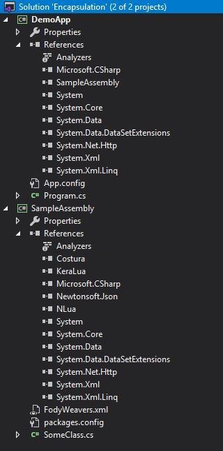
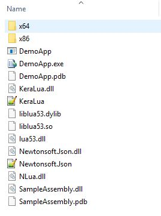
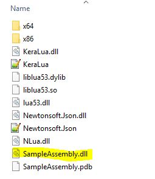

# Class library encapsulation

Sample project for issue:
[StackOverflow](https://stackoverflow.com/questions/60809652/encapsulates-class-library-with-costura-fody)

#### Solution tree

#### DemoApp output folder
I want to only SampleAssembly.dll here.

#### SampleAssembly output folder

# Solution
Downgrading the [Costura.Fody](https://www.nuget.org/packages/Costura.Fody/1.6.2) and [Fody](https://www.nuget.org/packages/Fody/2.0.0) solved the problem.
`lua53.dll` is excluded from the class library because ILmerge is not supported to merge unmanaged assemblies.
